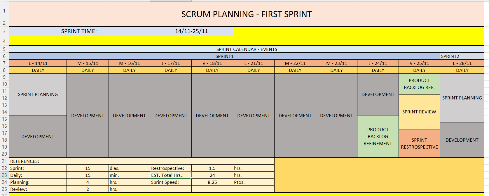

## Proyecto final ArgPrograma etapa YoProgramo

El trabajo lo estoy realizando, aplicando la metodología SCRUM. Dado que es mi portfolio, me considero en todas las posiciones que SCRUM determina. A saber: Product Owner, Scrum Master, Developer. Por tanto aunque parezca un poco redundante todo esto, lo estoy aplicando solo a modo de práctica, y en cada posición considero todos los aspectos que consideraría en caso de trabajar con un equipo real, teniendo que asumir alguna de dichas funciones.

Los archivos de informacion sobre el proyecto los van a encontrar en la carpeta /ProyectInfo en el directorio raiz.

## Capturas de ejemplo:

<figure>
<figcaption>App architecture</figcaption>
</figure>

<figure>
<figcaption>Product Backlog, Epics and some Features</figcaption>
</figure>

<figure>
<figcaption>Some User Stories</figcaption>
</figure>

<figure>
<figcaption>First Sprint Planing</figcaption>
</figure>

<figure>
<figcaption>SprintGoal, Sprint Backlog and Tasks</figcaption>
</figure>

<figure>
<figcaption>Acceptance Criteria</figcaption>
</figure>